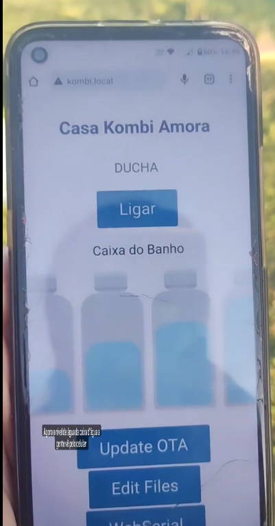

# Controle Remoto de Ducha da Casa Kombi Amora

This project is designed to manage and monitor various aspects of the Casa Kombi Amora system. It includes both firmware for the ESP8266 microcontroller and a web-based user interface built with Svelte and Vite.



## Project Structure

- **data/**: Contains web assets such as HTML, JavaScript, and CSS files.
- **include/**: Contains project header files.
- **lib/**: Contains project-specific libraries.
- **src/**: Contains the main firmware source code for the ESP8266.
- **test/**: Contains unit tests for the project.
- **ui/**: Contains the source code for the web-based user interface.

## Getting Started

### Prerequisites

- [PlatformIO](https://platformio.org/)
- [Node.js](https://nodejs.org/)
- [Visual Studio Code](https://code.visualstudio.com/)

### Building the Firmware

1. Open the project in Visual Studio Code.
2. Build the project using PlatformIO:
   ```sh
   pio run
   ```

### Uploading the Firmware

1. Connect your ESP8266 device.
2. Upload the firmware using PlatformIO:
   ```sh
   pio run --target upload
   ```

### Setting Up the Web Interface

1. Navigate to the `ui` directory:
   ```sh
   cd ui
   ```
2. Install the dependencies:
   ```sh
   npm install
   ```
3. Run the development server:
   ```sh
   npm run dev
   ```

Feel free to customize this README to better fit your project's needs.
